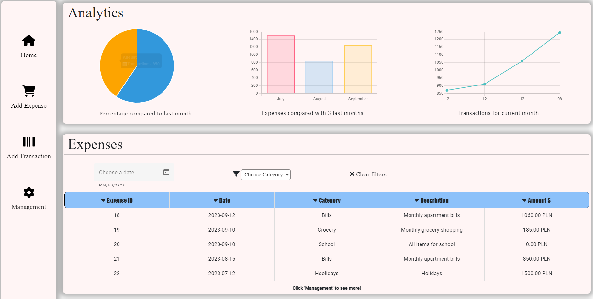
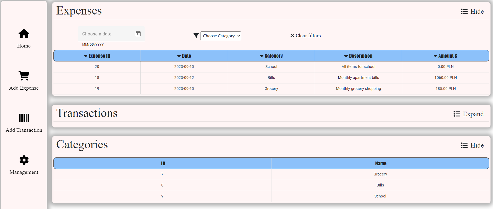

Expenses Management

Project is about managing expenses. The user can control what he spends his money on and check the comparison of expenses with previous months.


## Features
- login and registration system
- Add expense categories
- Add expense 
- Add transactions along with the amount of money spent associated with the expense
- Delete / Edit expenses and transactions


## 🛠 Built With
- TypeScript
- Angular
- Bootstrap
- Django
- Rest Framework
- PostgreSQL


## Installation

1. Clone the repo
```bash
git clone https://github.com/janmark101/ExpensesManagementSystem.git
```

2. Create virtual environment

```bash
python -m venv <name-of-your-enviroment> 
```

* Activate the virtual environment:
Windows
```bash
.\name-of-your-enviroment\Scripts\activate
```
macOS/Linux
```bash
source name-of-your-enviroment/bin/activate
```

3. Next install all necesary libraries with this command :

```bash
pip install -r requirements.txt
```

4. Prepare the database : 
```bash
python manage.py migrate
```

5. Start the server :
```bash
python manage.py runserver
```
6. Start server for angular app : 
```bash
ng serve
```

Navigate to `http://localhost:4200/`.
Home page : 


Management page : 

